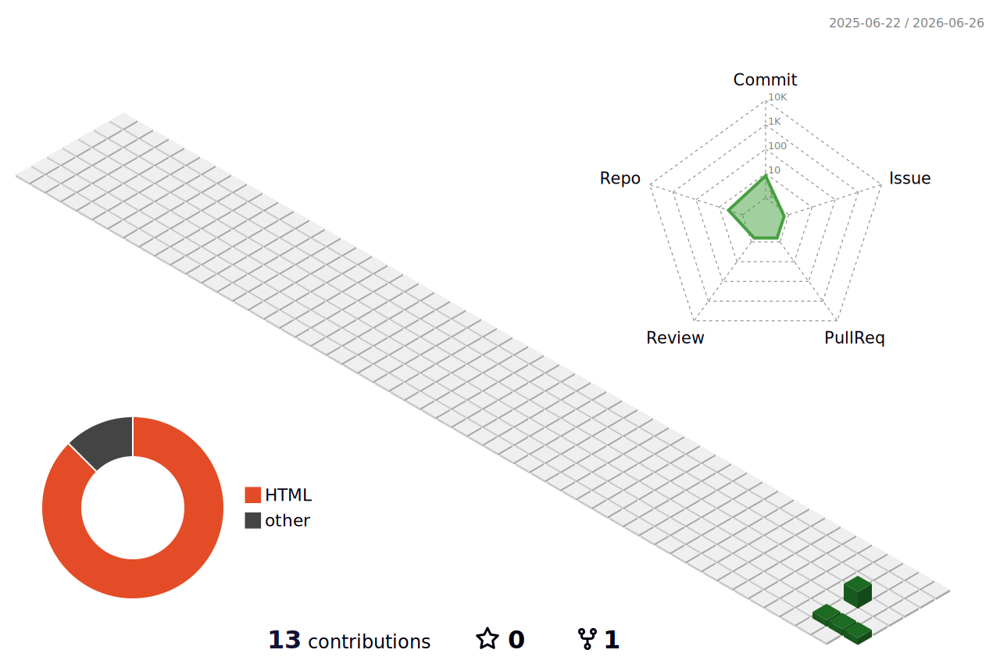

  

  

  
  
  

  <strong>Software Engineering Student | Web Developer | Tech Enthusiast</strong>

  <i>"Crafting immersive web experiences with code & creativity. Software engineer in the making, problem‑solver, and lover of modern tech."</i>

  

---

## 💫 About Me

- 🎓 I’m currently a **Software Engineering Student** pursuing my passion for technology.
- 💻 Passionate about building interactive, 3D, and fully-responsive web applications.
- 🛠️ Currently learning **JavaScript, Git, and GitHub** to expand my development toolkit.
- 🎨 Fun fact: I love transforming complex code ideas into beautiful, smooth user interfaces.
- 📍 Based in **Maharashtra, India**.

---

## 📊 3D Contribution Calendar
*(Automatically updated daily)*

  

---

## 🛠️ Tech Stack & Skills

### 🚀 Frontend & Design

  
  
  
  
  
  

### ⚙️ Backend, Programming Languages & Databases

  
  
  
  
  

### 🛠️ Developer Tools

  
  

### 🧠 Conceptual Skills
- **Data Structures & Algorithms (DSA)**
- **Database Management Systems (DBMS)**
- **Computer Networks**

---

## 📁 Featured Projects

<table width="100%">
  <tr>
    <td width="33%" valign="top">
      <h3 align="center">✨ Portfolio Website</h3>
      

        
        
      

      
Modern animated developer portfolio built with <strong>Three.js</strong>, <strong>Tailwind CSS</strong>, and glowing glassmorphic elements.

      

        <code>Three.js</code> &bull; <code>Tailwind</code> &bull; <code>HTML5</code>
      

    </td>
    <td width="33%" valign="top">
      <h3 align="center">🛒 E-Commerce Website</h3>
      

        
      

      
A responsive shopping user interface complete with an interactive cart, secure checkout, and dynamic product filtering.

      

        <code>React</code> &bull; <code>Node.js</code> &bull; <code>CSS3</code>
      

    </td>
    <td width="33%" valign="top">
      <h3 align="center">🐍 Snake Game</h3>
      

        
      

      
Classic arcade game designed with smooth keyboard controls, dynamic HTML5 canvas rendering, and a real-time scoreboard.

      

        <code>JavaScript</code> &bull; <code>Canvas</code> &bull; <code>CSS3</code>
      

    </td>
  </tr>
</table>

---

## 📈 GitHub Stats

  <table border="0">
    <tr>
      <td>
        
      </td>
      <td>
        
      </td>
    </tr>
  </table>

---

## 🤝 Let's Connect!

Feel free to reach out to me for collaborations, queries, or just to say hello!

- **Portfolio:** [saraswatid.netlify.app](https://saraswatid.netlify.app/)
- **LinkedIn:** [/in/saraswati-dubey](https://linkedin.com/in/saraswati-dubey)
- **Get in touch:** Fill out the contact form on my [website](https://saraswatid.netlify.app/#contact)!

  

